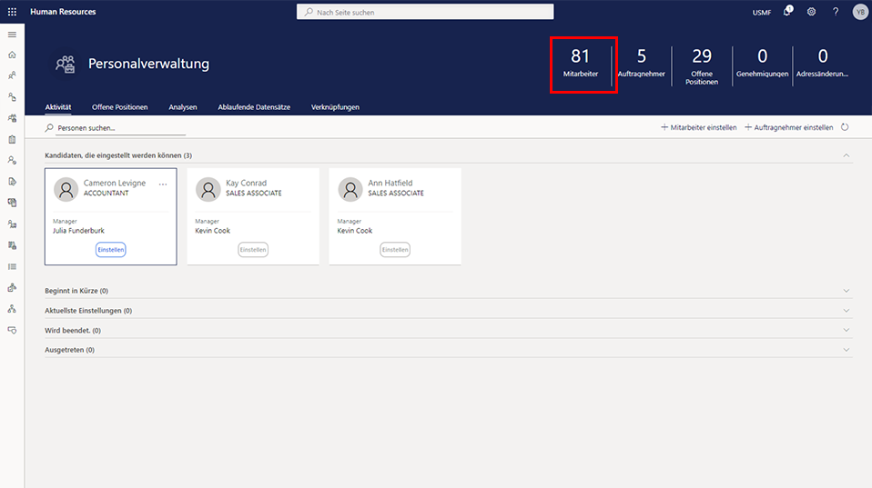

---
demo:
  title: 'Demo 1: Zuweisen von Lernkursen'
  module: 'Module 4: Learn the Fundamentals of Microsoft Dynamics 365 Human Resources'
---

## Demo 1 – Zuweisen von Lernkursen

1. Navigieren Sie zur Startseite von **Microsoft Dynamics 365 Human Resources**.  
    In Microsoft Dynamics 365 Human Resources, personnel managers can assign training courses to employees. In this example, the company’s new hire, Alicia, needs to be assigned the training that is available to employees within their first thirty days.

1. In the top-right company picker, verify that the company you are connecting to is <bpt id="p1">**</bpt>USMF<ept id="p1">**</ept>. If it’s not, change it to <bpt id="p1">**</bpt>USMF<ept id="p1">**</ept>.

1. Wählen Sie in der linken oberen Ecke des Bildschirms die Registerkarte **Personalverwaltung** aus.

1. Klicken Sie rechts auf der Seite **Personalverwaltung** auf die Nummer direkt über dem Wort **Mitarbeiter**.

    

1. In the <bpt id="p1">**</bpt>Employees<ept id="p1">**</ept> table, select the name of the employee to assign training to. For example, <bpt id="p1">**</bpt>Alicia Thornber<ept id="p1">**</ept>.  
    Verwenden Sie als nächstes die Registerkarte „Kompetenzen und Entwicklung“, um Links zu Informationen über Bescheinigungen, Ausbildung und Qualifikationen eines Mitarbeiters anzuzeigen.

1. Wählen Sie auf der Mitarbeiterseite die Registerkarte **Kompetenzen und Entwicklung** aus.

1. Wählen Sie im Abschnitt **Kompetenzen** die Option **Kurse** aus.  
    From an employee’s Courses page, you can see whether any courses have been assigned. In Alicia’s case, no courses are listed. To view available courses to assign, you need to select the Course ID menu.

1. Wählen Sie das Menü **Kurskennung** aus.

1. Wählen Sie in der Tabelle „Kurse“ das Menü **Kurskennung** aus.

1. Wählen Sie im Menü **Kurskennung** das Menü **Kursstatus** aus.

1. Wählen Sie im Menü **Kursstatus** das Feld für den **genauen Kursstatus** aus.  
    Sie müssen dann eventuell den angewendeten Filter für die **Kurskennung** bearbeiten, sodass der Filter z. B. nur offene Kurse anzeigt.

1. Wählen Sie im Feld für den **genauen Kursstatus** die Option **Öffnen** aus.

1. Wählen Sie im Menü **Kursstatus** die Option **Übernehmen** aus, um alle verfügbaren offenen Kurse anzuzeigen.  
    Jetzt können Sie Alicia den Schulungskurs für neue Mitarbeiter zuweisen.

1. In Microsoft Dynamics 365 Human Resources können Personalleiter den Mitarbeitern Schulungskurse zuweisen.

1. Wählen Sie im Bereich „Kursdaten übertragen?“ die Option **Ja** aus.

1. Wählen Sie auf der Seite **Kurse** in der Spalte **Startdatum** das **Kalendersymbol** aus.

1. In diesem Beispiel muss der neuen Mitarbeiterin Alicia die Schulung zugewiesen werden, die den Mitarbeitern innerhalb der ersten dreißig Tage zur Verfügung steht.

1. Wählen Sie in der Spalte **Enddatum** das **Kalendersymbol** aus.

1. In the calendar, select the end date for the training. For example, <bpt id="p1">**</bpt>January 8th 2021<ept id="p1">**</ept>.

1. Wählen Sie links auf der Seite **Kurse** die Option **Speichern** aus, um Ihre Änderungen zu speichern.

1. Wählen Sie rechts auf der Seite **Kurse** das **X** aus, um die Seite zu schließen.  
    Wenn Sie zugewiesene Kurse ändern müssen, wählen Sie erneut „Kurse“ aus.

1. Wählen Sie auf der Seite **Mitarbeiter** im Abschnitt **Kompetenzen** die Option **Kurse** aus.

1. Wählen Sie auf der Seite **Kurse** auf der Navigationsleiste die Option **Bearbeiten** aus, um Änderungen vorzunehmen.

1. Wählen Sie in der Spalte **Startdatum** das **Kalendersymbol** aus.

1. Stellen Sie in der Unternehmensauswahl oben rechts sicher, dass das Unternehmen, mit dem Sie eine Verbindung herstellen, **USMF** ist.

1. Wählen Sie **Speichern** aus.

1. Wählen Sie das Symbol **X** aus, um die Seite zu schließen.

1. Wählen Sie auf der Seite **Mitarbeiter** das Symbol **X** aus, um die Seite zu schließen.
