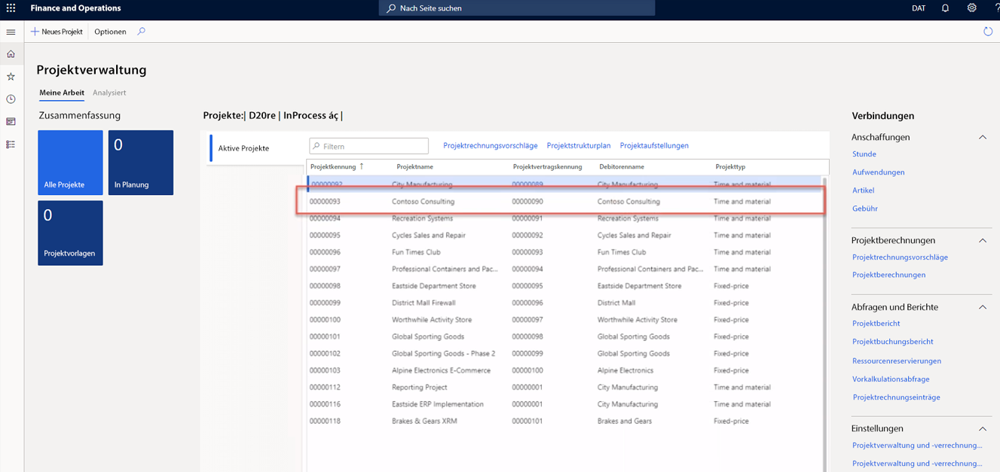

---
demo:
    title: 'Demo 1: Preise für Project Operations'
    module: 'Modul 5: Grundlagen von Microsoft Dynamics 365 Project Operations erlernen'
---

## Demo 1 – Preise für Project Operations

1. Navigieren Sie zum Arbeitsbereich **Projektverwaltung**.  
    In dieser Demo werden wir die Verkaufs- und Einstandspreise innerhalb von Project Operations einrichten. Und wir werden sehen, wie Kosten und Preise aus einer zuvor gebuchten Rechnung abgeleitet werden.

1. Stellen Sie in der Unternehmensauswahl oben rechts sicher, dass die juristische Person, mit der Sie verbunden sind, **USSI** ist.  
    Wenn das nicht der Fall ist, ändern Sie die Organisation in **USSI**.

1. Wählen Sie in der Tabelle **Aktive Projekte** das Projekt **00000093 Contoso Consulting** aus. Dadurch wird die Detailansicht des Projekts geöffnet.

    

1. Wählen Sie auf der Seite **Contoso Consulting** auf der Navigationsleiste die Option **Verwalten** aus.

1. Wählen Sie im Menü **Verwalten** die Option **Rechnungserfassungen** aus.  
    Hier haben wir eine Rechnung gefunden, bei der Stunden angerechnet wurden.

1. Zeigen Sie unter **Rechnungstransaktionen** in der Spalte **Verkaufspreis** auf **350,00**.  
    Wir können in dieser Ansicht sehen, dass der Verkaufspreis für die Ressource „Aaron Con“, ein Projektmanager für USSI, einen Gebührensatz von 350 USD aufweist. Schauen wir uns die Preisgestaltung an, um zu prüfen, wie dieser Gebührensatz bestimmt wurde.

      

    Obwohl wir die Preise im einzelnen Projekt betrachten können, wechseln wir in den Arbeitsbereich **Projektverwaltung**, damit alle eingerichteten Preise angezeigt werden.

1. Navigieren Sie zum Arbeitsbereich **Projektverwaltung**.

1. Wählen Sie auf der rechten Seite des Bildschirms im Abschnitt **Verknüpfungen** im Untermenü **Einrichtung** die Option **Verkaufspreis (Stunde)** aus.

1. Zeigen Sie auf der Seite **Verkaufspreis – Stunde** in der Spalte **Preise** der Tabelle auf **350,00**.  
In dieser Ansicht können wir erkennen, wo der Verkaufspreis von Aaron Con von 350 USD eingerichtet wurde.

1. Zeigen Sie auf die gesamte erste Zeile.  
    Wenn wir uns die gesamte Zeile ansehen, können wir erkennen, dass Aaron als Projektmanager eingerichtet und der Gebührensatz einer bestimmten Projektkennung für Contoso Consulting zugeordnet ist.

1. Zeigen Sie in der Spalte **Ressource** auf alle anderen Zeilen, denen Ressourcen zugewiesen sind.  
    Wir können in dieser Tabelle erkennen, dass auch andere Projektmanager eingerichtet sind, aber sie sind nicht speziell den Projektkennungen zugeordnet. Daher sind ihre Gebührensätze nur für die Kategorie und die zugewiesenen Ressourcen bestimmt.

      

    Diese Matrix ist ausreichend flexibel, um die Detailebene zu unterstützen, die wir bei Contoso Consulting und Aaron Con gesehen haben, aber auch um ein allgemeineres Preismodell wie den hier gezeigten Preis von 300 USD zu unterstützen.

1. Navigieren Sie für das Contoso-Projekt zur Seite **Rechnungserfassungen**.  
    Wir wechseln zurück zur gebuchten Rechnung und betrachten dieselbe gebuchte Stundentransaktion. Dabei überprüfen wir die Aaron Con zugeordneten Kosten, indem wir die Buchungskennung in der Zeile der Rechnungsbuchung auswählen.

1. Wählen Sie im Abschnitt **Rechnungstransaktionen** die Registerkarte **Stunde** aus. Wählen Sie in der sich öffnenden Tabelle in der Spalte **Buchungskennung** eine Buchungskennung aus.

    

1. Wählen Sie auf der Registerkarte **Stundenbuchungen** die Option **Übersicht** aus. Zeigen Sie in der sich öffnenden Tabelle in der Spalte **Einstandspreis** auf **200,00**.  
    In der Ansicht der Stundenbuchungen sehen wir den Eintrag für Aaron Con und den zugeordneten Einstandspreis von 200 USD. Sehen wir uns jetzt noch einmal die Einrichtung des Einstandspreises an, um zu prüfen, wie dieser Verrechnungssatz abgeleitet wurde.

1. Navigieren Sie zum Arbeitsbereich **Projektverwaltung**.

1. Wählen Sie auf der rechten Seite des Bildschirms im Abschnitt **Verknüpfungen** im Untermenü **Einrichtung** die Option **Einstandspreis (Stunde)** aus.

1. Zeigen Sie auf der Seite **Einstandspreis – Stunde: Standardansicht** in der Tabelle auf die Zeile mit **01.01.2014** in der Spalte **Gültigkeitsdatum**, **Nachmittag** in der Spalte **Kategorie**, **200,00** in der Spalte **Einstandspreis** und ohne Werte in den anderen Spalten.  
    In dieser Ansicht sehe ich einen Einstandspreis von 200 USD, der speziell für die Kategorie „Nachmittag“ eingerichtet wurde, aber es gibt keine anderen Zeilen, die spezifisch für Aaron oder unser Contoso Consulting-Projekt sind. Auch dies ist eine gängige Methode, da viele Dienstorganisationen Standardverrechnungssätze über Kategorien hinweg anwenden, die in diesem Fall als Projektrolle identifiziert werden. Bei diesen Kosten handelt es sich oft um einen Mischtarif, bei dem der individuelle Ressourcenlohnsatz nur im Lohn- oder Personalsystem gespeichert wird. Der Standardverrechnungssatz wird dann in regelmäßigen Abständen angepasst, wenn die Lohnkosten analysiert werden, um sicherzustellen, dass sie korrekt sind und die Margen eingehalten werden.

    

1. Navigieren Sie zum Arbeitsbereich **Projektverwaltung**.

1. Zeigen Sie auf der rechten Seite des Bildschirms im Abschnitt **Verknüpfungen** im Untermenü **Einrichtung** auf **Einstandspreis (Stunde)** und **Verkaufspreis (Stunde)**.  

In dieser Demonstration haben wir untersucht, wie standardmäßige Verkaufs- und Einstandspreise in Project Operations eingerichtet werden. Wir haben ihre Auswirkungen auf eine gebuchte Rechnung überprüft, um zu erfahren, wie sich die Einrichtung dieser Preise direkt auf die vorgelegte Aufwandsrechnung auswirkt.
