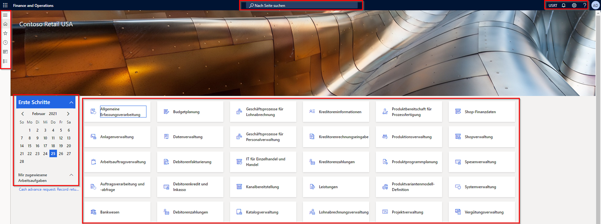
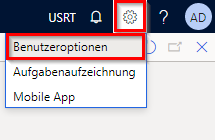
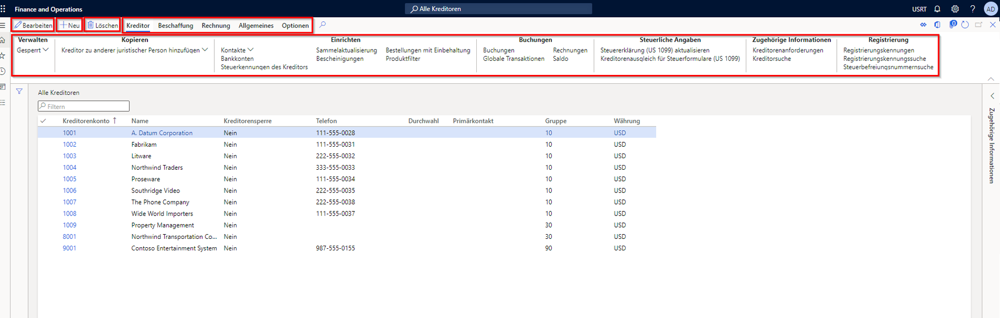

---
lab:
  title: 'Lab 1: In den Finance and Operations-Apps navigieren'
  module: 'Module 1: Explore the core capabilities of Dynamics 365 finance and operations apps'
ms.openlocfilehash: f1d534e6d6d960be8f6672048f83a20a491264cc
ms.sourcegitcommit: 8e5a278c6e08abdcc3fb719796f79842e868606b
ms.translationtype: HT
ms.contentlocale: de-DE
ms.lasthandoff: 07/14/2022
ms.locfileid: "147116214"
---
# Modul 1: Erkunden der Kernfunktionen der Finanz- und Betriebs-Apps von Microsoft Dynamics 365

## Lab 1 – In den Finance and Operations-Apps navigieren

## Ziele

Nachdem Sie sich mit den Finance and Operations-Apps vertraut gemacht haben, nehmen Sie sich etwas Zeit, um die Benutzeroberfläche zu erkunden.

## Lab-Einrichtung

- **Geschätzte Dauer**: 10 Minuten

## Anweisungen

### Melden Sie sich beim Lab-Computer an

1. Melden Sie sich mit den folgenden Anmeldeinformationen beim Lab-Computer an

    - User Name (Benutzername):

        Inhalt einfügen

        Administrator

    - Password (Kennwort):

        Inhalt einfügen

        pass@word1

    >[!Note] Möglicherweise wird Internet Explorer automatisch auf dem Desktop geöffnet. Wenn Sie die Schritte 2 bis 5 noch nicht ausgeführt haben, schließen Sie sie bitte ab, bevor Sie zu Internet Explorer zurück navigieren.

1. Wählen Sie die Datei **AdminUserProvisioning** auf dem Desktop aus.

1. Geben Sie angegebenen Anmeldeinformationen ein, und klicken Sie dann auf **Senden**.  
Ihre Anmeldeinformationen finden Sie im Menü **Ressourcen** in der oberen rechten Ecke des Bildschirms.

1. Warten Sie auf den Abschluss des Skripts, bevor Sie fortfahren. Dies kann 2-3 Minuten dauern. Wenn das Skript abgeschlossen ist, wird ein Popupfeld angezeigt, um zu bestätigen, dass der Admin-Benutzer erfolgreich aktualisiert wurde.

1. Wählen Sie **OK** aus, um fortzufahren.

1. Öffnen Sie **Internet Explorer**.

1. Öffnen Sie den angegebenen Link: <https://usnconeboxax1aos.cloud.onebox.dynamics.com>

1. Melden Sie sich mit den Anmeldeinformationen an, die im Menü **Ressourcen** bereitgestellt werden.

### In den Finance and Operations-Apps navigieren
1. Auf der Finance and Operations-Startseite wird Ihnen Folgendes angezeigt, soweit konfiguriert:

    - Das Navigationsmenü auf der linken Seite, das standardmäßig reduziert ist

    - Logo Ihres Unternehmens

    - Arbeitsbereichskacheln, die Ihnen basierend auf Ihrer Rolle in der Organisation zur Verfügung stehen

    - Kalender und Arbeitselemente, die Ihnen zugewiesen wurden

    - Die Suchleiste, die sehr nützlich ist, um schnell zu finden, was Sie brauchen

    - Oben rechts sehen Sie das Unternehmen, mit dem Sie gerade arbeiten, Benachrichtigungen, Einstellungen und Hilfelinks.  
    Überprüfen Sie, ob das aufgeführte Unternehmen **USMF** ist.

    

1. Wählen Sie oben links das Hamburger-Menü **Navigationsbereich erweitern** aus.

1. Im Navigationsbereich finden Sie Sammlungen für Ihre **Favoriten**, **Aktuellen** Artikel, **Arbeitsbereiche** und **Module**.

1. Wählen Sie im Navigationsbereich **Module** > **Systemadministration** aus.

1. Überprüfen Sie die im Systemverwaltungsmodul verfügbaren Bereiche.

1. Wählen Sie unter **Einrichtung** **Clientleistungsoptionen** aus.

1. Wählen Sie im Bereich „Clientleistungsoptionen“ unter **Funktionslegenden aktiviert** den Umschalter aus, und vergewissern Sie sich, dass sie auf **Ja** festgelegt ist.

1. Überprüfen Sie die anderen verfügbaren Optionen, scrollen Sie zum unteren Rand des Fensters, und wählen Sie dann **OK** aus.

1. Wählen Sie auf der Startseite in der oberen rechten Ecke das Symbol „Einstellungen“ und dann „Benutzeroptionen“ aus.

    

1. Verwenden Sie auf der Seite „Optionen“ die Registerkarten, um verschiedene Einstellungen zu konfigurieren, die für Ihr Konto gelten.

1. Wählen Sie die Registerkarte **Einstellungen** aus.

1. Informieren Sie sich über die verfügbaren Einstellungen. Beachten Sie, dass Sie das Standardunternehmen und die erste Seitenansicht ändern können, die beim Anmelden angezeigt werden.

1. Wählen Sie die Registerkarten **Konto** und **Workflow** aus, und überprüfen Sie sie.

1. Wählen Sie im linken Navigationsmenü das Symbol **Start** aus.

1. Wählen Sie auf der Startseite in der oberen rechten Ecke der Seite das Feld **Nach einer Seite suchen** aus.

1. Suchen Sie im Suchfeld nach **Alle Kreditoren**.

1. Möglicherweise müssen Sie bei der ersten Suche nach einer Seite warten. Während der Suche wird rechts neben dem Suchfeld ein kleiner Kreis angezeigt.

1. Die Seite „Alle Kreditoren“ ist ein Beispiel für eine Listenseite. Die Listenseite enthält im allgemeinen Stammdaten, die gelesen, erstellt, gelöscht und aktualisiert werden können. Mithilfe des über der Liste angezeigten Menübands werden zusätzliche Funktionen angezeigt.

    

1. Markieren Sie einen der Kreditoren in der Liste, und wählen Sie rechts das Menü **Zugehörige Informationen** aus. Prüfen Sie die bereitgestellten zusätzlichen Informationen.

1. Wählen Sie in der Kreditorenliste **Acme Office Supplies** aus.

1. Wählen Sie das Menü **Gruppe** und dann den Spaltentitel **Kreditorengruppe** aus.

    

1. In vielen Menüs stehen Sortier- und Filterfunktionen zur Verfügung. Verwenden Sie die Filter, um den gesuchten Feldinhalt schnell zu finden.

1. Beachten Sie oben rechts die zusätzlichen Funktionen. Bewegen Sie Ihre Maus zu jedem Element und überprüfen Sie die Funktionsbeschriftung. Wählen Sie nach Abschluss das Symbol **Schließen** aus, um die Seite zu schließen und zur Startseite zurückzukehren.

    

1. Wählen Sie in der rechten oberen Ecke das Fragezeichensymbol **Hilfe** und dann **Hilfe** aus.

1. Beachten Sie, dass sich die Hilfeinformationen auf die aktuelle Seite beziehen.

1. Versuchen Sie, eine Arbeitsbereichskachel auszuwählen und überprüfen Sie dann die Hilfeinformationen für diesen Arbeitsbereich. Kehren Sie zum Abschluss zur Startseite zurück.
