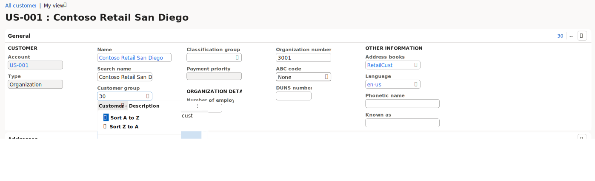

---
lab:
  title: 'Lab 1.1: Navigieren in Finanz- und Betriebs-Apps'
  module: 'Learning Path 1: Explore the core capabilities of Dynamics 365 finance and operations apps'
---

# Lernpfad 1: Erkunden der Kernfunktionen der Finanz- und Betriebs-Apps von Microsoft Dynamics 365
# Modul 1: Beschreiben der Finanz- und Betriebs-Apps

## Lab 1.1: Navigieren in Finanz- und Betriebs-Apps

## Ziel

Nachdem Sie sich mit den Finance and Operations-Apps vertraut gemacht haben, nehmen Sie sich etwas Zeit, um die Benutzeroberfläche zu erkunden.

## Lab-Einrichtung

- **Geschätzte Dauer**: 10 Minuten

## Anweisungen

### Melden Sie sich beim Lab-Computer an

1.  Melden Sie sich mit den folgenden Anmeldeinformationen beim Lab-Computer an:

    - Benutzername: `Administrator`

    - Kennwort: `pass@word1`

1.  Dieses Lab wurde so konfiguriert, dass Ihr Administratorbenutzerkonto automatisch bereitgestellt wird. Nach Abschluss des Vorgangs wird Edge automatisch geöffnet und fordert Sie auf, sich anzumelden. Sie können sich mit den bereitgestellten Anmeldeinformationen anmelden, die auf der Registerkarte „Ressourcen“ zu finden sind. Falls dieser Vorgang fehlschlägt, lesen Sie bitte den nachstehenden Hinweis. Andernfalls können Sie mit dem Lab fortfahren. 

    >Doppelklicken Sie auf dem Desktop auf „AdminUserProvisioning“.
Geben Sie im Feld „E-Mail-Adresse“ den Benutzernamen aus **Ressourcen** ein, und klicken Sie dann auf „Absenden“.
Warten Sie, bis die Eingabeaufforderung angezeigt wird, dass der Administratorbenutzer erfolgreich aktualisiert wurde auf... ein, und klicken Sie dann auf OK.   

1.  **Microsoft Edge**öffnet die „Finance & Operations“-URL: <https://usnconeboxax1aos.cloud.onebox.dynamics.com>

1.  Melden Sie sich mit dem Benutzernamen und dem Kennwort an, der bzw. das im Menü **Ressourcen** angegeben ist. 

### In den Finance and Operations-Apps navigieren

Nachdem Sie sich mit den Finance and Operations-Apps vertraut gemacht haben, nehmen Sie sich etwas Zeit, um die Benutzeroberflächen zu erkunden.

1.  Auf der **Finance and Operations**-Startseite wird Ihnen Folgendes angezeigt, soweit konfiguriert:

    - Das Navigationsmenü auf der linken Seite, das standardmäßig reduziert ist

    - Logo Ihres Unternehmens

    - Arbeitsbereichskacheln, die Ihnen basierend auf Ihrer Rolle in der Organisation zur Verfügung stehen

    - Kalender und Arbeitselemente, die Ihnen zugewiesen wurden

    - Die Suchleiste, die nützlich ist, um schnell zu finden, was Sie brauchen

    - Oben rechts sehen Sie das Unternehmen, mit dem Sie gerade arbeiten, Benachrichtigungen, Einstellungen und Hilfelinks. Überprüfen Sie, ob das aufgeführte Unternehmen **USMF** ist.

    
2.  Wählen Sie oben links das Hamburger-Menü **Navigationsbereich erweitern** aus.

3.  Im Navigationsbereich finden Sie Sammlungen für Ihre **Favoriten**, **Aktuellen** Artikel, **Arbeitsbereiche** und **Module**.

4.  Wählen Sie im Navigationsbereich **Module** > **Systemadministration** aus.

5.  Überprüfen Sie die im Systemverwaltungsmodul verfügbaren Bereiche.

6.  Wählen Sie unter **Einrichtung** **Clientleistungsoptionen** aus.

7.  Wählen Sie im Bereich **Clientleistungsoptionen** unter **Funktionslegenden aktiviert** den Umschalter aus, und vergewissern Sie sich, dass er auf **Ja** festgelegt ist.

8.  Überprüfen Sie die anderen verfügbaren Optionen, scrollen Sie zum unteren Rand des Fensters, und wählen Sie dann **OK** aus.

9.  Wählen Sie auf der **Startseite** in der oberen rechten Ecke das Symbol **Einstellungen** und dann **Benutzeroptionen** aus.

    

10. Verwenden Sie auf der Seite **Optionen** die Registerkarten, um verschiedene Einstellungen zu konfigurieren, die für Ihr Konto gelten.

11. Wählen Sie die Registerkarte **Einstellungen** aus.

12. Informieren Sie sich über die verfügbaren Einstellungen. Beachten Sie, dass Sie das Standardunternehmen und die erste Seitenansicht ändern können, die beim Anmelden angezeigt werden.

13. Wählen Sie die Registerkarten **Konto** und **Workflow** aus, und überprüfen Sie sie.

14. Wählen Sie im linken Navigationsmenü das Symbol **Start** aus.

15. Wählen Sie auf der **Startseite** in der oberen rechten Ecke der Seite das Feld **Nach einer Seite suchen** aus.

16. Suchen Sie im Suchfeld nach **Alle Kunden**.

17. Wählen Sie die Seite **Debitorenkonten** > **Kunden** > **Alle Kunden**. 

18. Möglicherweise müssen Sie bei der ersten Suche nach einer Seite warten. Während des Suchvorgangs dreht sich ein kleiner Kreis rechts neben dem Suchfeld.

19. Die Seite **Alle Kunden** ist ein Beispiel für eine Listenseite. Die Listenseite enthält Stammdaten, die gelesen, erstellt, gelöscht und aktualisiert werden können. Weitere Funktionen sind über das Menüband oberhalb der Liste verfügbar.

    

20. Markieren Sie eine Kundin oder einen Kunden aus der Liste und wählen Sie auf der rechten Seite das Menü **Zugehörige Informationen**, und überprüfen Sie die bereitgestellten Informationen.

    

21. In der Liste **Kunden** wählen Sie **Contoso Retail San Diego**.

22. Wählen Sie das Menü **Gruppe**, und wählen Sie dann den Spaltentitel **Debitorengruppe**.

    

23. In vielen Menüs stehen Sortier- und Filterfunktionen zur Verfügung. Verwenden Sie die Filter, um den gesuchten Feldinhalt schnell zu finden.

24. Beachten Sie oben rechts die zusätzlichen Funktionen. Bewegen Sie Ihre Maus zu jedem Element und überprüfen Sie die Funktionsbeschriftung. Wählen Sie nach Abschluss das Symbol **Schließen** aus, um die Seite zu schließen und zur **Startseite** zurückzukehren.

    

