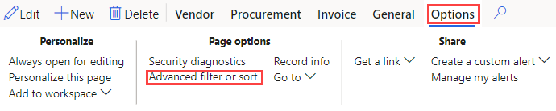
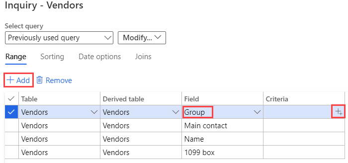

---
lab:
  title: 'Lab 2: Erkunden Sie Arbeitsbereiche und Filtern'
  module: 'Module 1: Learn the Fundamentals of Microsoft Dynamics 365 Supply Chain Management'
ms.openlocfilehash: 0a2815e312b9798dcf93ec6cee669eb65a1f9942
ms.sourcegitcommit: 252458fca8e71b6e5e8b99ae4c2b47cd85461a30
ms.translationtype: HT
ms.contentlocale: de-DE
ms.lasthandoff: 01/27/2022
ms.locfileid: "137909928"
---
# Modul 1: Grundlagen von Microsoft Dynamics 365 Supply Chain Management erlernen

## Lab 2 – Arbeitsbereich und Filterung erkunden

## Ziele

Bei der ersten Anmeldung bei Finance and Operations stehen Ihnen viele Arbeitsbereiche zur Verfügung. Sie können auch einen eigenen Arbeitsbereich mit Inhalten erstellen, die auf Ihre Bedürfnisse zugeschnitten sind. Arbeitsbereiche sind eine der vielen Funktionen von Dynamics 365, aber Sie sollten wissen, dass das Filtern der Weg ist, um wirklich zu den spezifischen Elementen zu gelangen, nach denen Sie möglicherweise suchen. Sie müssen einen neuen personalisierten Arbeitsbereich erstellen und mithilfe der Filterung verschiedene Elemente identifizieren, die Sie benötigen.

## Lab-Einrichtung

   - **Geschätzte Dauer**: 10 Minuten

## Anweisungen

1. Klicken Sie auf der Finance and Operations-Startseite rechts neben den Arbeitsbereichskacheln mit der rechten Maustaste in einen leeren Bereich, um das Menü aufzurufen, oder klicken und halten Sie.

    

1. Wählen Sie im Menü **Personalisieren: TilePageContainer** aus.

1. Wählen Sie im Fenster „Personalisieren“ die Option **+ Arbeitsbereich hinzufügen** aus.

1. Wenn das kleine Fenster „Personalisieren“ nicht sichtbar ist, versuchen Sie, nach oben zur Startseite zu scrollen und mit der rechten Maustaste zu klicken oder zu klicken und zu halten. Wählen Sie dann erneut **Personalisieren: TilePageContainer** aus.

    

1. Scrollen Sie auf der Startseite nach unten und suchen Sie die neue Kachel **Mein Arbeitsbereich 1**.

    

1. Klicken Sie mit der rechten Maustaste auf die Kachel oder tippen und halten Sie. Wählen Sie dann **Personalisieren: Mein Arbeitsbereich 1** aus.

1. Benennen Sie im Fenster „Personalisieren“ „Mein Arbeitsbereich 1“ in **Mein Arbeitsbereich** um, und wählen Sie dann die Seite **Diese Seite personalisieren** aus.  
    Die Namensänderung wird automatisch gespeichert.

1. Wählen Sie in der neu geöffneten Symbolleiste **Verschieben** aus.

    

1. Wählen Sie Ihre Kachel **Mein Arbeitsbereich** aus und verschieben Sie sie dann an eine andere Position auf der Startseite.

    >[!Note] Wenn Sie die Kachel nicht verschieben können, aktualisieren Sie die Seite und wiederholen Sie die vorherigen Schritte, um die Kachel zu verschieben.

1. Schließen Sie die Symbolleiste.

1. Suchen Sie auf der Startseite im Feld **Nach Seite suchen** und wählen Sie **Alle Kreditoren** aus.

1. Wählen Sie auf der Seite „Alle Kreditoren“ im oberen Menü **Optionen** > **Zum Arbeitsbereich hinzufügen** aus.

1. Geben Sie im Filterfeld **Arbeitsbereich** **Mein Arbeitsbereich** ein, und wählen Sie dann den Arbeitsbereich aus.

1. Wählen Sie das Menü „Präsentation“ aus, um die verfügbaren Optionen zu prüfen und dann **Kachel**.

1. Wählen Sie nach Abschluss **Konfigurieren** aus.

1. Überprüfen Sie im Bereich „Als Kachel hinzufügen“ den Kachelnamen und wählen Sie dann **OK** aus.

1. Wählen Sie im linken Navigationsbereich das Symbol **Start** aus.

1. Wählen Sie auf der Startseite Ihren neuen Arbeitsbereich aus.

1. Überprüfen Sie auf der Seite „Mein Arbeitsbereich“, ob die neu hinzugefügte Kachel „Kreditoren“ angezeigt wird.

1. Wählen Sie die Kachel **Kreditoren** aus.

1. Geben Sie auf der Seite „Alle Kreditoren“ im Feld **Filter** die Zeichenfolge **Contoso** ein.

1. Überprüfen Sie die verschiedenen Felder, die zum Auffinden von Contoso verwendet werden können.

    

1. Wählen Sie **Name: „Contoso“** aus, und überprüfen Sie dann die Filterergebnisse.

1. Deaktivieren Sie das Filterfeld und drücken Sie die Eingabetaste, um alle Kreditoren anzuzeigen.

1. Wählen Sie den Spaltentitel **Gruppe** aus.

    

1. Sie können dies verwenden, um die Gruppen nach dem niedrigsten zum höchsten (Sortieren von A bis Z) oder dem höchsten zum niedrigsten (Sortieren von Z zu A) zu sortieren.

1. Wählen Sie unter **Gruppe** das Menü **Beginnt mit** aus und überprüfen Sie die Vergleichsoperatoren. Wählen Sie **ist genau** aus.

1. Wählen Sie das Menü unter **ist genau** und dann **Andere Kreditoren** aus.  
    Alternativ können Sie einen Wert in das Menüfeld eingeben.

1. Wählen Sie **Anwenden** aus und prüfen Sie dann die Ergebnisse. Beachten Sie das Filtersymbol in der Spaltenüberschrift der Gruppe.

    

1. Wählen Sie die Spalte **Gruppe** und im Filtermenü dann **Löschen** aus.

1. Wählen Sie links neben dem Titel „Alle Kreditoren“ das Symbol „Filter“ aus.

    

1. Wählen Sie im rechten oberen Filterbereich **+ Hinzufügen** aus.

1. Aktivieren Sie im Bereich „Filterfelder hinzufügen“ das Kontrollkästchen links neben **Gruppe**, und wählen Sie dann „Aktualisieren“ aus.

1. Beachten Sie den zusätzlichen Filter, der hinzugefügt wurde. Auf diese Weise können Sie die Liste nach mehr als einem Kriterium filtern.

    

1. Wählen Sie im Filter **Kreditorenkonto beginnt mit** das Menü und dann **Northwind Traders** aus.

1. Wählen Sie im Filter **Gruppe beginnt mit** das Menü und dann **30** aus.

1. Wählen Sie **Anwenden** aus, und prüfen Sie dann die Filterergebnisse.

1. Wählen Sie im Bereich „Filter“ die Option **Zurücksetzen** aus und beachten Sie, dass der zusätzliche Filter entfernt und der Standardfilter auf einen leeren Wert zurückgesetzt wurde.

1. Wählen Sie in der Menübandleiste **Optionen** und in den Abschnitten „Seitenoptionen“ dann **Erweiterter Filter oder Sortierung** aus.

    

1. Wählen Sie im Fenster „Abfrage – Kreditoren“ **+ Hinzufügen** aus.

1. Wählen Sie in der neuen Zeile in der Zelle „Feld“ das Menü und dann **Gruppe** aus.

1. Alternativ können Sie das Menü auswählen, den Namen der Gruppe eingeben und ihn dann aus den Ergebnissen des Filters auswählen.

1. Wählen Sie in der Zelle „Kriterien“ das Symbol **Öffnen** aus.

    

1. Wählen Sie in der Gruppenliste „Kreditor“ die Option **30 andere Kreditoren** aus.

1. Um die neue Abfrage zu speichern, wählen Sie unter **Abfrage auswählen** das Menü **Ändern** und dann **Speichern unter** aus.

    

1. Geben Sie im Bereich „Abfrage speichern“ im Feld **Name** „Meine Abfrage“ ein und wählen Sie **OK** aus.

1. Wählen Sie auf der Seite „Abfrage – Kreditor“ die Option **OK** aus.

1. Überprüfen Sie, ob die Liste die Ergebnisse der neu erstellten Abfrage widerspiegelt.

1. Um den Filter zu entfernen, wählen Sie **Erweiterter Filter oder Sortierung** und auf der Seite „Abfrage - Kreditor“ die Option **Zurücksetzen** und dann **OK** aus.

1. Dadurch wird die Abfrage zurückgesetzt, Ihre gespeicherte Abfrage wird jedoch nicht gelöscht.
