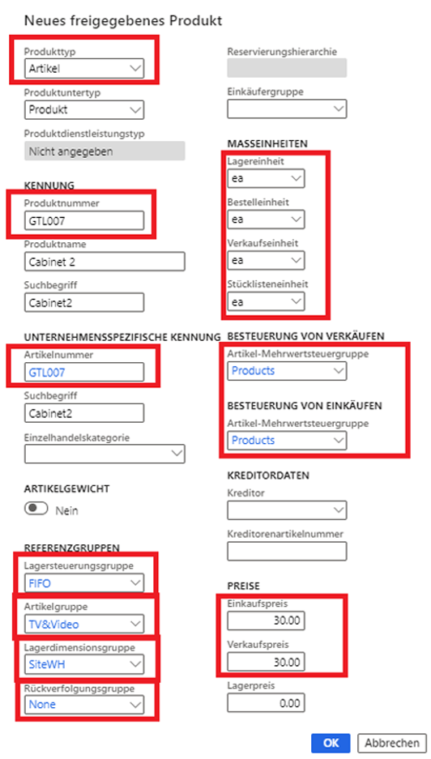
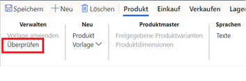
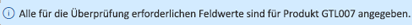

---
lab:
    title: 'Lab 3: Produktangebot mit verschiedenen Größen und Farben erstellen'
    module: 'Modul 1: Grundlagen von Microsoft Dynamics 365 Supply Chain Management erlernen'
---

# Modul 1: Grundlagen von Microsoft Dynamics 365 Supply Chain Management erlernen

## Lab 3 – Neues Produkt erstellen

## Ziele

Im Unternehmen Contoso Entertainment System USA (USMF) müssen Sie einen neuen Artikel für eine neue Gehäusekonfiguration erstellen, die Sie bei einem Kreditor erwerben können.

## Lab-Einrichtung

   - **Geschätzte Dauer**: 10 Minuten

## Anweisungen

1. Überprüfen Sie auf der Finance and Operations-Startseite oben rechts, ob Sie mit dem USMF-Unternehmen zusammenarbeiten.

1. Wählen Sie bei Bedarf das Unternehmen und im Menü **USMF** aus.

1. Wählen Sie oben links das Hamburger-Menü **Navigationsbereich erweitern** aus.

1. Wählen Sie im Navigationsbereich **Module** > **Produktinformationsmanagement** und dann **Freigegebene Produkte** in der Kategorie **Produkte** aus.

1. Wählen Sie auf der Seite „Details“ im oberen Menü **+ Neu** aus.

1. Stellen Sie im Bereich „Neues freigegebenes Produkt“ im Menü **Produkttyp** sicher, dass **Artikel** ausgewählt ist.

1. Stellen Sie im Menü **Produktuntertyp** sicher, dass **Produkt** ausgewählt ist.

1. Wählen Sie das Menü **Rückverfolgungsgruppe** und dann **Keine** aus.

1. Geben Sie unter **IDENTIFIZIERUNG** in den Feldern **Produktnummer** und **Artikelnummer** die Nummer **GTL007** ein.

1. Geben Sie im Feld **Produktname** die Bezeichnung **Gehäuse 2** ein.

1. Wählen Sie unter **REFERENZGRUPPEN** das Menü **Lagersteuerungsgruppe** und dann **FIFO (First-In-First-Out)** aus.

1. Wählen Sie das Menü **Artikelgruppe** und dann **TV&Video** aus.

1. Wählen Sie das Menü **Lagerdimensionsgruppe** und dann **SiteWH** aus.

1. Überprüfen Sie unter **MASSEINHEITEN**, dass die folgenden Werte eingestellt sind:

    | **Einstellung**| **Wert**|
    | :--- | :--- |
    | Bestandseinheit| in Stück|
    | Bestelleinheit| in Stück|
    | Verkaufseinheit| in Stück|
    | BOM-Einheit| in Stück|

1. Wählen Sie unter **MEHRWERTSTEUER** das Menü **Artikel-Mehrwertsteuergruppe** und dann **ALLE** aus.

1. Wählen Sie unter **BESTEUERUNG VON EINKÄUFEN** das Menü **Artikel-Mehrwertsteuergruppe** und dann **ALLE** aus.

1. Geben Sie unter „PREISE“ im Feld „Einkaufspreis“ „30,00“ ein.

1. Geben Sie im Feld „Verkaufspreis“ „30,00“ ein.

1. Ihre neue Produktfreigabe sollte folgendermaßen aussehen:

    

1. Klicken Sie auf **OK**.

1. Wählen Sie auf der Menübandleiste unter **Verwalten** die Option **Überprüfen** aus, um sicherzustellen, dass das Produkt finalisiert wurde.

    

1. Stellen Sie sicher, dass Ihnen das Informationsbanner angezeigt wird, das bestätigt, dass alle erforderlichen Feldwerte validiert wurden.

    

1. Schließen Sie alle Seiten, und kehren Sie zur Startseite zurück.
