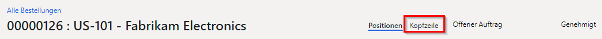
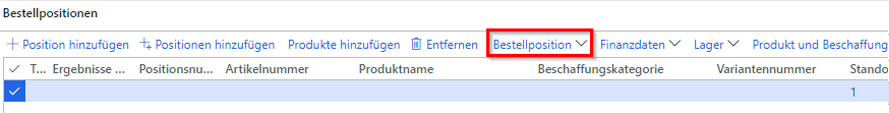

---
lab:
    title: 'Lab 4: Bestellung erstellen'
    module: 'Modul 1: Grundlagen von Microsoft Dynamics 365 Supply Chain Management erlernen'
---

# Modul 1: Grundlagen von Microsoft Dynamics 365 Supply Chain Management erlernen

## Lab 4 – Bestellung erstellen

## Ziele

Typischer ist es, dass Bestellungen automatisch als Ergebnis von Produktprogrammplanung, Direktlieferung und anderen Prozessen erstellt werden. Bei der manuellen Erstellung einer Bestellung wird sie normalerweise von einem Einkaufsvertreter erstellt. Erstellen Sie eine Bestellung unter Verwendung des USMF-Unternehmens.

## Lab-Einrichtung

   - **Geschätzte Dauer**: 10 Minuten

## Anweisungen

1. Überprüfen Sie auf der Finance and Operations-Startseite oben rechts, ob Sie mit dem USMF-Unternehmen zusammenarbeiten.

1. Wählen Sie bei Bedarf das Unternehmen und im Menü **USMF** aus.

1. Wählen Sie oben links das Hamburger-Menü **Navigationsbereich erweitern** aus.

1. Wählen Sie **Module** > **Beschaffung** > **Bestellungen** > **Alle Bestellungen** aus.

1. Wählen Sie auf der Seite „Alle Bestellungen“ im oberen Menü die Option **+ Neu** aus.

1. Wählen Sie im Bereich „Bestellung anlegen“ das Menü **Kreditorenkonto** und dann **US-101** aus.

1. Wenn Sie einen Kreditor auswählen, werden Details aus dem Kreditorendatensatz wie Adresse, Rechnungskonto, Lieferbedingungen und Lieferart als Standardwerte in den Auftragskopf kopiert. Sie können diese Werte jederzeit ändern.

1. Erweitern Sie den Abschnitt **Allgemein**.

1. Wählen Sie unter **LAGERDIMENSIONEN** das Menü **Standort** aus und überprüfen Sie die Liste der Standorte.

1. Das Feld „Standort“ gibt zusammen mit dem Feld „Lager“ an, wohin die beschafften Waren oder Dienstleistungen geliefert werden müssen. Die Standardlieferadresse ist der Standort. Beide Felder können mit Werten gefüllt werden, die für den ausgewählten Kreditor eingerichtet wurden, oder Sie können sie manuell angeben.

1. Unter **TERMINE** wird das Feld Lieferdatum verwendet, um festzulegen wann beschaffte Waren und Dienstleistungen geliefert werden müssen.

1. Sie können einen einzelnen Liefertermin für den Auftrag angeben, oder den einzelnen Auftragspositionen können eindeutige Liefertermine zugewiesen werden. Wenn das hier angegebene Lieferdatum für bestimmte Produkte oder Dienstleistungen nicht eingehalten werden kann, weil sie längere Vorlaufzeiten haben, werden diese Zeilen mit einem späteren Lieferdatum erstellt, um dies zu berücksichtigen.

1. Erweitern Sie den Abschnitt **Verwaltung**. Im Feld **Besteller** können Sie angeben, wer den Auftrag erteilt.

1. Dies kann zweckmäßig sein, um es dem Kreditor mitzuteilen, falls er diese Person kontaktieren muss. Der Wert kann automatisch zugewiesen werden, wenn das aktuelle Benutzerkonto einem Namen auf der Seite Benutzer zugeordnet ist.

1. Wählen Sie **OK** aus.

1. Der Auftragskopf wurde nun erstellt. Wenn Sie mit Bestellpositionen arbeiten, wird nur eine Zusammenfassung der Kopfzeileninformationen angezeigt. Wenn Sie den Rest der Informationen anzeigen möchten, wählen Sie **Kopfzeile** aus.

    

1. Wählen Sie unter **Bestellpositionen** im Menü die Option **Bestellposition** aus.

    

1. Wählen Sie unter **DISPLAY** **Dimensionen** aus.

1. Produkte können in Varianten vorliegen, die sich nach Dimensionen wie Farbe, Größe oder Stil unterscheiden. Produkte können auch so eingerichtet werden, dass sie Lagerdimensionen wie Standort und Lager verwenden. Es gibt auch optionale Rückverfolgungsangaben wie Chargen- und Seriennummern. Um die Effizienz der Auftragserfassung zu verbessern, können Sie die üblicherweise verwendeten Dimensionsfelder direkt zum Auftragsraster hinzufügen.

1. Wählen Sie im Anzeigebereich Dimensionen unter **PRODUKTDIMENSIONEN** das Kontrollkästchen **Farbe** aus.

1. Optional: Wenn Sie den Umschalter „Einstellungen speichern“ auswählen, werden die von Ihnen ausgewählten Dimensionen beim nächsten Öffnen der Bestellseite auch im Raster der Bestellposition angezeigt.

1. Wählen Sie **OK** aus.

1. Wählen Sie das Zellenmenü **Artikelnummer** und dann **T0004** aus.

1. Denken Sie daran, dass Sie auch das Filterfeld eingeben können, anstatt durch die Liste zu scrollen.

1. Bestellpositionen werden für Produkte und Dienstleistungen durch Angabe einer Artikelnummer oder als Aufwand durch Angabe einer Beschaffungskategorie angelegt.

1. Die Beschaffungskategorie wird zum Hinzufügen von Zeilen verwendet, in denen beschaffte Artikel direkt als Aufwand erfasst werden, anstatt in den Bestand aufgenommen zu werden. Dies bedeutet, dass Sie, wenn Sie einen Einkauf verrechnen müssen, eine Bestellposition erstellen können, in der eine Beschaffungskategorie angegeben ist, anstatt eine Zeile mit einer Artikelnummer zu erstellen. Artikel können auch einer Beschaffungskategorie zugeordnet werden. In diesem Fall wird die Beschaffungskategorie nur zu Informationszwecken angezeigt.

1. Öffnen Sie das Menü **Farbe**, überprüfen Sie im Menü die verfügbaren Optionen und wählen Sie dann eine der Farben oder Farbkombinationen aus.

1. Standort und Lager werden normalerweise mit Werten aus dem Auftragskopf gefüllt. Es ist jedoch möglich, die Felder zu überschreiben, wenn einige Zeilen an verschiedene Standorte geliefert werden müssen.

1. Geben Sie im Feld **Menge** **10** ein.

1. Die Menge wird automatisch mit der Mindestbestellmenge für das Produkt gefüllt, wenn diese eingerichtet ist, oder mit dem Wert „1“.

1. Weitere Informationen:

    - **Einheit**: Zeigt die Maßeinheit für die bestellte Menge an. Normalerweise wird die Einheit automatisch von der Einkaufseinheit in den Produktstammdaten bereitgestellt.

    - **Preis je Einheit**: Enthält einen Wert aus einem Kaufvertrag oder einem Handelsvertrag. Es ist möglich, den Stückpreis in einzelnen Bestellpositionen zu ändern – beispielsweise wenn mit dem Kreditor ein eindeutiger Preis ausgehandelt wird.

    - **Rabatt**: Stellt einen Rabattbetrag pro Einheit dar. Dieser Rabatt reduziert daher den Stückpreis um den Rabatt. Dieser Rabatt wird normalerweise automatisch aus Kaufverträgen oder Handelsvereinbarungen geliefert. Es ist jedoch möglich, einzelne Zeilen zu überschreiben, wenn mit dem Kreditor eindeutige Rabatte ausgehandelt wurden.

    - **Rabattprozentsatz**: Bei Eingabe wird der Nettobetrag für die Zeile entsprechend reduziert. Der Rabattprozentsatz wird normalerweise automatisch aus Kaufverträgen oder Handelsvereinbarungen geliefert. Es ist jedoch möglich, einzelne Zeilen zu überschreiben, wenn mit dem Kreditor ein eindeutiger Rabattprozentsatz ausgehandelt wurde.

    - **Nettobetrag**: Berechnet aus anderen Feldern in der Zeile, einschließlich Menge, Stückpreis, Rabatt und Rabattprozentsatz. Es ist möglich, den Nettobetrag zu ändern, aber dann sind die Felder „Einstandspreis“, „Rabatt“ und „Rabattprozentsatz“ leer und wenn Sie zur Zeile buchen, ist der gebuchte Betrag proportional zum Nettobetrag. Im Allgemeinen wird das Feld „Nettobetrag“ nur zur Anzeige des Nettobetrags der Zeile verwendet.

1. Wählen Sie unter den Bestellpositionen unten auf der Seite die Option **Positionsdetails** aus.

1. Wählen Sie die Registerkarte **Lieferung** aus.

1. Jeder Bestellposition kann eine eindeutige Auftragsposition zugewiesen werden. Das Datum wird vom Feld im Bestellkopf übernommen, Sie können dies jedoch ändern.

1. Schließen Sie die Seite „Bestellposition“.

1. Verwenden Sie auf der Seite „Alle Bestellungen“ die Filterfunktion und suchen Sie Ihre neue Bestellung.

1. Wenn Sie fertig sind, schließen Sie die Seite „Alle Bestellungen“ und kehren Sie zur Startseite zurück.
