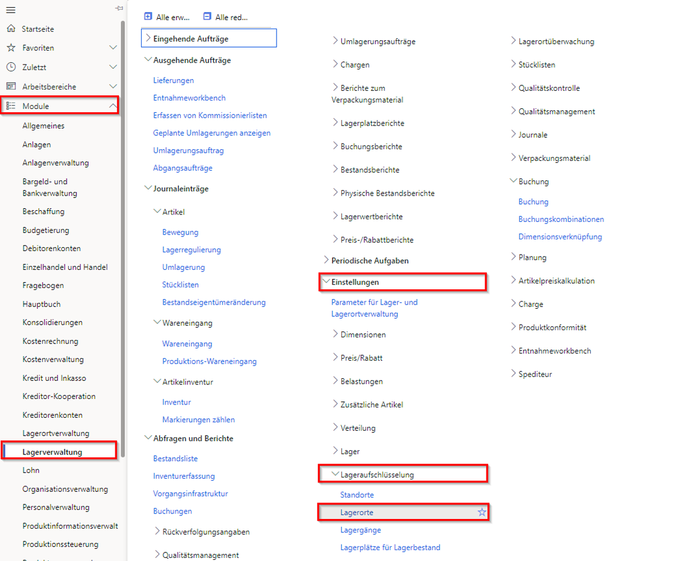

---
lab:
    title: 'Lab 5: Lager erstellen'
    module: 'Modul 1: Grundlagen von Microsoft Dynamics 365 Supply Chain Management erlernen'
---

# Modul 1: Grundlagen von Microsoft Dynamics 365 Supply Chain Management erlernen

## Lab 5 – Lager erstellen

## Ziele
Das Lagerverwaltungssystem in Supply Chain Management bietet flexible Möglichkeiten zur Definition Ihres Lagerortlayouts, um den sich ändernden Anforderungen gerecht zu werden und eine optimale Lagerorteffizienz zu erzielen.

- Sie können Lagerortbereiche zur optimalen Platzierung von Waren mit hoher und niedriger Priorität einrichten.
- Sie können Ihren Lagerort in Zonen aufteilen zur Berücksichtigung unterschiedlicher Lageranforderungen wie beispielsweise Temperaturvoraussetzungen oder verschiedene Umschlagsgeschwindigkeiten bei Artikeln
- Sie können Lagerplätze auf beliebiger Ebene festlegen (beispielsweise Standort, Lager, Gang, Regal, Regalboden und Lagerfach).
- Sie können Standorte mithilfe der Einstellungen für Einschränkungen der physischen Kapazität gruppieren.
- Sie können steuern, wie Artikel basierend auf abfragedefinierten Regeln gelagert und kommissioniert werden.

Damit Sie die Lagerortverwaltung im Supply Chain Management verwenden können, müssen Sie einen Lagerort erstellen und ihn für erweiterte oder spezialisierte Lagerortverwaltungsaktivitäten aktivieren.

## Lab-Einrichtung

   - **Geschätzte Dauer**: 10 Minuten

## Anweisungen

1. Überprüfen Sie auf der Finance and Operations-Startseite oben rechts, ob Sie mit dem USMF-Unternehmen zusammenarbeiten.

1. Wählen Sie bei Bedarf das Unternehmen und im Menü **USMF** aus.

1. Wählen Sie im linken Navigationsbereich **Module** > **Bestandsverwaltung** > **Einrichtung** > **Bestandsaufschlüsselung** > **Lager** aus.

    

1. Wählen Sie auf der Seite „Lager“ im oberen Menü die Option **Neu** aus.

1. Geben Sie im Feld **Lager** den Wert **101** ein.

1. Geben Sie im Feld **Name** **Überlauf Lager** ein.

1. Wählen Sie das Menü **Site** und dann **3 Schaumproduktion Bau** aus.

1. Erweitern Sie **Lagerplatznamen**.  
    Die Optionen in diesem Abschnitt definieren das Standardformat für Standortnamen.

1. Legen Sie die Optionen **Gang einbeziehen** und **Regal einbeziehen** auf **Ja** fest.

1. Geben Sie im Feld **Format** für das Regal einen Wert ein.  
    Wenn das Format des Standortnamens für Regal z. B. OVFL enthalten muss, würden Sie diesen Wert in das Feld „Format“ eingeben.

1. Legen Sie unter **EBENE** die Option **Regal einbeziehen** auf **Ja** fest.

1. Geben Sie im Feld **Format** für das Regal **-##** ein.

1. Wählen Sie oben im Menü **Lager** aus.

    

1. Wählen Sie unter **Verwalten** die Option **Lagerplatz-Assistent** aus.

1. Überprüfen Sie auf der Begrüßungsseite die Informationen, und wählen Sie dann in der unteren rechten Ecke **Weiter** aus.

1. Deaktivieren Sie die Kontrollkästchen **Ausgangsrampen** und **Sammellagerplätze**.

1. Wählen Sie **Weiter** aus, und prüfen Sie die Informationen.

1. Fahren Sie mit jeder Seite fort, und wählen Sie dann nach Abschluss **Fertig** aus.

1. Schließen Sie die Seite, und kehren Sie zur Startseite zurück.
