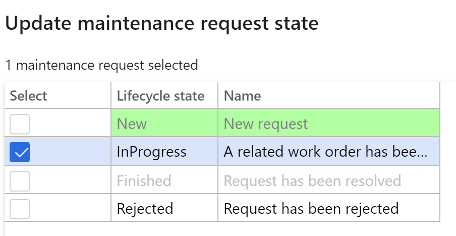
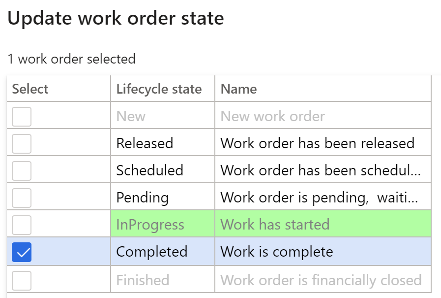

---
lab:
    title: 'Lab 7: Arbeitsauftrag aus einer Wartungsanfrage erstellen'
    module: 'Modul 1: Grundlagen von Microsoft Dynamics 365 Supply Chain Management erlernen'
---

## Lab 7 – Arbeitsauftrag aus einer Wartungsanfrage erstellen

**Ziele**

Wartungsaufträge, die in das System eingegeben werden, beschreiben die an einer Anlage erforderliche Wartung oder Reparatur und weisen die entsprechenden Ressourcen zur Erledigung der Wartungsanfrage zu. Der Arbeitsauftrag wird auf der Grundlage des Wartungsauftrags erstellt, der von der zugewiesenen Ressource ausgeführt wird.

**Lab-Einrichtung**

Geschätzte Dauer: 15 Minuten

**Anweisungen**

1. Überprüfen Sie auf der Finance and Operations-Startseite oben rechts, ob Sie mit dem USMF-Unternehmen zusammenarbeiten.

2. Wählen Sie bei Bedarf das Unternehmen und im Menü **USMF** aus.

3. Wählen Sie im linken Navigationsbereich **Module** **&gt; Anlagenverwaltung &gt; Einrichtung &gt; Wartungsanfrage &gt; Lebenszyklusstatus** aus.

4. Wählen Sie „InProgress“ aus, und klicken Sie im Aktionsbereich auf die Schaltfläche **Bearbeiten**.

5. Ändern Sie auf der Registerkarte **Allgemein** den Wert für **Arbeitsauftrag erstellen** in „Ja“.

6. Wählen Sie im linken Navigationsbereich **Module** **&gt; Anlagenverwaltung &gt; Arbeitsbereiche &gt; Wartungsauftragsverwaltung** aus.

7. Klicken Sie auf **Wartungsauftrag erstellen.**

8. Geben Sie die folgenden Werte in den Feldern des Dialogfensters ein, und klicken Sie auf die Schaltfläche **OK**.

	- Wartungsanfragentyp: Corrective

	- Beschreibung: Noise in the metal detector

	- Funktionaler Standort PP-02-02

	- Anlage: MD-201

	- Serviceebene 4

	- Fehlersymptom: Excessive noise

	- Fehlerbereich: Electrical 

9. Schließen Sie das Formular **Wartungsanfrage**, und kehren Sie zum Arbeitsbereich **Wartungsanfragenverwaltung** zurück.

10. Aktualisieren Sie die Seite, indem Sie auf das Symbol **Aktualisieren** oben rechts auf dem Bildschirm klicken.

11. Die neue Wartungsanfrage wird in der Liste der Wartungsanfragen ohne Arbeitsauftrag angezeigt.

12. Wählen Sie die neu erstellte Wartungsanfrage aus, und klicken Sie auf die Schalfläche **Wartungsanfragenstatus aktualisieren**. 

13. Aktivieren Sie im Dialogfenster das Kontrollkästchen neben „InProgress“, und klicken Sie auf **OK**.

 

14. Wählen Sie die neu erstellte Wartungsanfrage aus, und klicken Sie auf die Schalfläche **Arbeitsauftrag erstellen**. 

15. Geben Sie die folgenden Werte in den Feldern des Dialogfensters ein, und klicken Sie auf die Schaltfläche **OK**.

	- Wartungsauftragstyp: Inspektion

16. Es wird ein neuer Arbeitsauftrag erstellt, und der Arbeitsauftrag wird im ausgewählten Datensatz für die Wartungsanfrage aktualisiert.

17. Klicken Sie auf den Arbeitsauftrag, und navigieren Sie zum Bildschirm **Arbeitsauftragsdetails**.

18. Klicken Sie unter den Positionen des Arbeitsauftrags und die Schaltfläche **Disponieren**.

19. Geben Sie die folgenden Werte in den Feldern des Dialogfensters ein, und klicken Sie auf die Schaltfläche **OK**.

	- Verantwortlicher: Ted Howard

20. Navigieren Sie im Aktionsmenü zu **Arbeitsauftrag &gt; Lebenszyklusstatus &gt; Arbeitsauftragsstatus aktualisieren.**

21. Aktivieren Sie im Dialogfenster das Kontrollkästchen neben „InProgress“, und klicken Sie auf **OK**.

22. Legen Sie im Dialogfenster im Feld **Tatsächlicher Start** das Datum und die Uhrzeit aus, und klicken Sie auf **OK.**

23. Navigieren Sie dann vom Aktionsmenü „Arbeitsauftrag“ erneut zu **Arbeitsauftrag &gt; Lebenszyklusstatus &gt; Arbeitsauftragsstatus aktualisieren.**

24. Aktivieren Sie im Dialogfenster das Kontrollkästchen neben „Abgeschlossen“, und klicken Sie auf **OK**.

25. Wählen Sie im Feld **Tatsächliches Ende** ein Datum und eine Uhrzeit aus, die nach dem Startdatum und der Startzeit liegen, und klicken Sie auf „OK“.

26. Der aktuelle Lebenszyklusstatus wird in der Kopfzeile des Arbeitsauftrags als abgeschlossen angezeigt.
