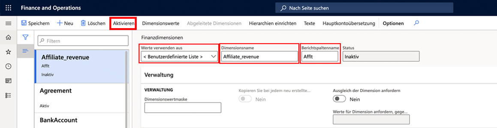
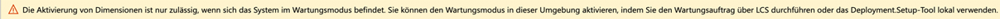

---
lab:
    title: 'Lab 1: Finanzdimension erstellen'
    module: 'Modul 2: Grundlagen von Microsoft Dynamics 365 Finance erlernen'
---

## Lab 1 – Finanzdimension erstellen

## Ziele

Verwenden Sie die Seite Finanzdimensionen, um Finanzdimensionen zu erstellen, die Sie als Kontosegmente für Kontenpläne verwenden können. Es gibt zwei Arten von Finanzdimensionen: benutzerdefinierte Dimensionen und entitätsbasierte Dimensionen. Benutzerdefinierte Dimensionen werden unter juristischen Personen geteilt und die Werte werden von Benutzern eingegeben und gepflegt. Für entitätsbasierte Dimensionen werden die Werte an einer anderen Stelle im System definiert, zum Beispiel in den Entitäten Kunden oder Geschäfte. Manche entitätsbasierte Dimensionen werden unter juristischen Entitäten geteilt, während andere entitätsbasierte Dimensionen unternehmensspezifisch sind.

Sie müssen eine benutzerdefinierte Finanzdimension erstellen, die von Ihren Unternehmen verwendet wird.

## Lab-Einrichtung

   - **Geschätzte Dauer**: 5 Minuten

## Anweisungen

1. Überprüfen Sie auf der Finance and Operations-Startseite oben rechts, ob Sie mit dem USMF-Unternehmen zusammenarbeiten.

1. Wählen Sie bei Bedarf das Unternehmen und im Menü **USMF** aus.

1. Wählen Sie im linken Navigationsbereich **Module** > **Finanzbuchhaltung** > **Kontenplan** > **Dimensionen** > **Finanzdimensionen** aus.

1. Wählen Sie oben im Menü **+ Neu** aus.

1. Wählen Sie auf der Seite Finanzielle Dimensionen das Menü **Werte verwenden aus** und dann **< Benutzerdefinierte Dimension >** aus.

1. Geben Sie im Namensfeld **Dimension** den Namen **Affliate_Revenue** ein.

1. Geben Sie im Feld **Berichtsspaltenname** den Text **Afflt** ein.

1. Wählen Sie im oberen Menü **Aktivieren** aus.

    

1. Überprüfen Sie die Informationen im Dialogfeld, und wählen Sie dann **Schließen** aus.

1. Überprüfen Sie das Warnbanner.

    

    >[!HINWEIS] Der Wartungsmodus kann direkt über Lifecycle Services (LCS) in Ihrer Sandbox und Produktionsumgebung ein- und ausgeschaltet werden. Weitere Informationen zum Verwalten von Lifecycle Services finden Sie unter [https://docs.microsoft.com/de-de/dynamics365/fin-ops-core/dev-itpro/deployment/maintenanceoperationsguide-newinfrastructure](https://docs.microsoft.com/de-de/dynamics365/fin-ops-core/dev-itpro/deployment/maintenanceoperationsguide-newinfrastructure).
