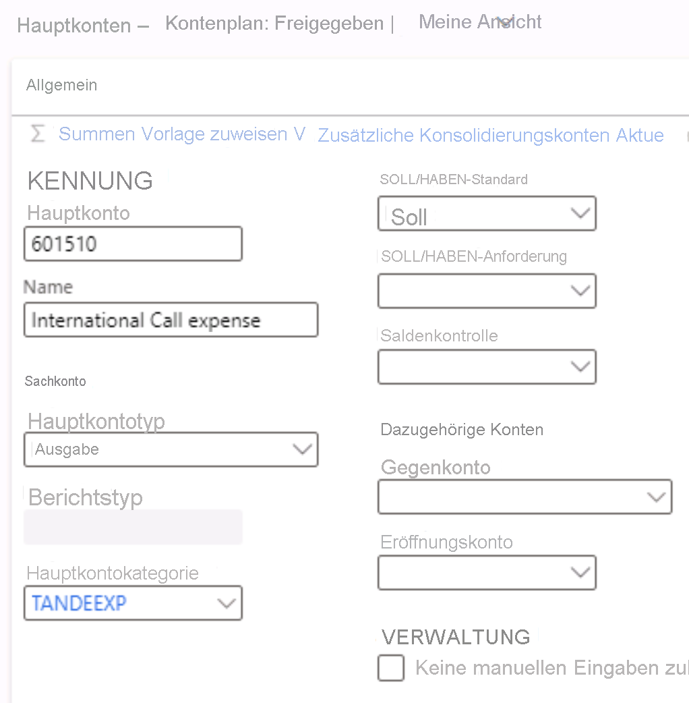

---
lab:
  title: 'Lab 1: Erstellen eines Hauptkontos'
  module: 'Module 2: Learn the Fundamentals of Microsoft Dynamics 365 Finance'
---
    
# Modul 2: Grundlagen von Microsoft Dynamics 365 Finance erlernen
    
## Lab 1: Erstellen eines Hauptkontos

## Anweisungen

1. Überprüfen Sie auf der Homepage von **Finance and Operations** rechts oben, ob Sie mit dem Unternehmen USMF arbeiten.

2. Wählen Sie bei Bedarf das Unternehmen und im Menü **USMF** aus.

3. Wählen Sie im Navigationsbereich links **Module** > **Hauptbuch** > **Kontenplan** > **Konten** > **Hauptkonten** aus.

4. Wählen Sie oben im Menü **+ Neu** aus.

5. Geben Sie auf der Seite „Hauptkonto“ die folgenden Werte ein:

    - Hauptkonto: **601510**

    - Name: **International call expense** (Internationale Anrufkosten)

    - Hauptkostentyp: **Expense**

    - Hauptkontokategorie: **TANDEEXP**

    - DB/CR-Standard: **Debit**

 
