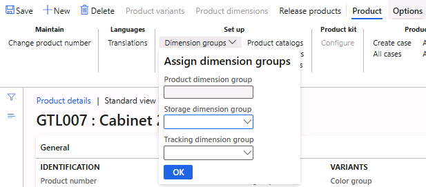
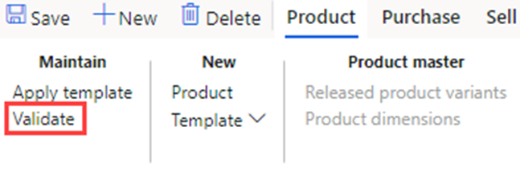

---
lab:
  title: 'Lab 1: Erstellen eines neuen Produkts'
  module: 'Module 3: Learn the Fundamentals of Microsoft Dynamics 365 Supply Chain Management'
---

# Modul 3: Grundlagen von Microsoft Dynamics 365 Supply Chain Management erlernen

## Lab 1: Erstellen eines neuen Produkts

## Ziel

Im Unternehmen Contoso Entertainment System USA (USMF) planen Sie eine neue Konfiguration eines Gehäuses eines Kreditors. Sie müssen ein Element erstellen, um die neue Konfiguration darzustellen. In diesem Lab lernen Sie, wie Sie einen neuen Artikel und neue Artikelkonfigurationen erstellen können.

## Lab-Einrichtung

   - **Geschätzte Dauer**: 10 Minuten

## Anweisungen

In Contoso Entertainment System USA (USMF) möchten Sie eine neue Konfiguration eines Gehäuse von einem Anbieter erwerben. Sie müssen ein Element erstellen, um die neue Konfiguration darzustellen.

1.  Überprüfen Sie auf der Finance and Operations-Startseite oben rechts, ob Sie mit dem **USMF**-Unternehmen arbeiten. Wählen Sie bei Bedarf im Dropdownmenü für Unternehmen **USMF** aus.

2.  Wählen Sie oben links das Hamburger-Menü **Navigationsbereich erweitern** aus.

3.  Wählen Sie im Navigationsbereich **Module** und dann **Produktinformationsverwaltung** aus. Wählen Sie dann im Menü **Produkte** die Option **Produkte** aus.

4.  Wählen Sie auf der Seite **Produkte** im oberen Menü die Option **+ Neu** aus.

5.  Überprüfen Sie im Bereich **Neues Produkt** im Feld **Produkttyp**, ob **Artikel** ausgewählt ist.

6.  Vergewissern Sie sich im Feld **Produktuntertyp**, dass **Produkt** ausgewählt ist.

7.  Geben Sie unter **IDENTIFIZIERUNG** im Feld **Produktnummer** die Nummer **GTL007** ein.

8.  Geben Sie im Feld **Produktname** die Bezeichnung **Gehäuse 2** ein.

    

9.  Klicken Sie auf die Schaltfläche **OK**.

10. Wählen Sie im Aktionsbereich im Menü **Produkt** unter der Gruppe **Einrichten** die Option **Dimensionsgruppen** aus.

    

11. Wählen Sie das Dropdownmenü **Lagerdimensionsgruppe** und dann **SiteWH** aus.

12. Wählen Sie das Dropdownmenü **Rückverfolgungsgruppe** und dann **SiteWH** aus.

13. Klicken Sie auf die Schaltfläche **OK**.

14. Wählen Sie im Aktionsbereich die Schaltfläche **Produkte freigeben** aus, um das Produkt in einer rechtlichen Einheit freizugeben.

15. Eine Seite wird geöffnet, auf der der erste Schritt als **Zu veröffentlichende Produkte auswählen** angezeigt wird.

    

16. Wählen Sie unten auf der Seite die Schaltfläche **Weiter** aus.

17. Wählen Sie auf der Seite **Unternehmen für die Freigabe auswählen** den Rechtsträger **USMF** aus, für den das Produkt veröffentlicht werden soll.

18. Wählen Sie unten auf dieser Seite die Schaltfläche **Weiter** aus.

19. Legen Sie auf der Seite **Auswahl bestätigen** den Wert **Infolog bei Fehler anzeigen** auf **Ja** und **Als Batch ausführen** auf **Nein** fest.

20. Wählen Sie unten auf dieser Seite die Schaltfläche **Fertigstellen** aus.

21. Wählen Sie im Navigationsbereich Module und dann Produktinformationsverwaltung aus. Wählen Sie dann im Menü Produkte die Option **Freigegebene Produkte** aus.

22. Suchen Sie auf der Seite **Freigegebene****Produkte** den neuen Eintrag **GTL007** im Raster. 

23. Wählen Sie den Produktlink aus, und navigieren Sie zur Seite **Produktdetails**.

24. Geben Sie im Inforegister **Allgemein** die folgenden Informationen ein:

    - **Lagersteuerungsgruppe**: FIFO

25. Geben Sie im Inforegister **Kauf** die folgenden Informationen ein:

    - **Einheit**: ea

    - **Artikel-Mehrwertsteuergruppe**: ALLE

    - **Preis**: 30

26. Geben Sie im Inforegister **Verkauf** die folgenden Informationen ein:

    - **Einheit**: ea

    - **Artikel-Mehrwertsteuergruppe**: ALLE

    - **Preis**: 35

27. Geben Sie im Inforegister **Bestandsverwaltung** die folgenden Informationen ein:

    - **Einheit**: ea

28. Geben Sie im Inforegister **Techniker** die folgenden Informationen ein:

    - **Stücklisteneinheit**: ea

29. Geben Sie im Inforegister **Kosten verwalten** die folgenden Informationen ein:

    - **Artikelgruppe**: Audio

30. Wählen Sie im Aktionsbereich Produkt aus, um die Konfiguration abzuschließen. Wählen Sie die Schaltfläche Überprüfen unter der Gruppe Verwalten aus.

    

31. Stellen Sie sicher, dass Ihnen das Informationsbanner angezeigt wird, das bestätigt, dass alle erforderlichen Feldwerte überprüft wurden.

    

32. Schließen Sie alle Seiten, und kehren Sie zur Startseite zurück.
