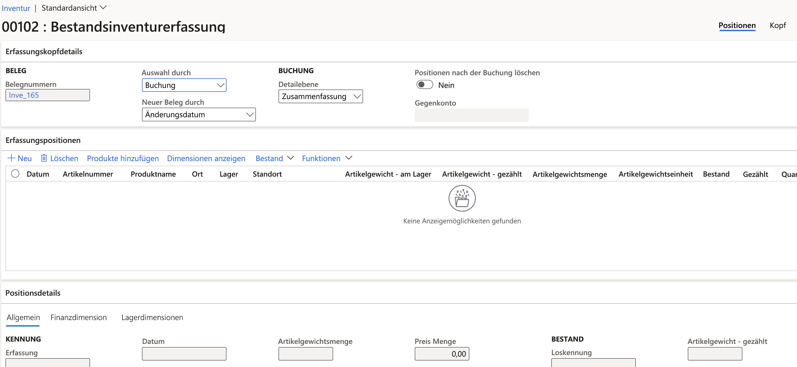

---
lab:
  title: "Lab\_3: Erstellen einer Inventurerfassung"
  module: 'Module 3: Learn the Fundamentals of Microsoft Dynamics 365 Supply Chain Management'
---

# Modul 3: Grundlagen von Microsoft Dynamics 365 Supply Chain Management erlernen

## Lab 3: Erstellen einer Inventurerfassung

## Lab-Einrichtung

   - **Geschätzte Dauer**: 10 Minuten

## Anweisungen

1.  Überprüfen Sie auf der **Finance and Operations**-Startseite oben rechts, ob Sie mit dem **USMF**-Unternehmen arbeiten. Wählen Sie bei Bedarf das Unternehmen und dann im Dropdownmenü **USMF** aus. 

2.  Wählen Sie im linken Navigationsbereich im Modul **Bestandsverwaltung** **Journaleinträge** > **Artikelinventur** > **Inventur** aus. 

3.  Wählen Sie im Aktionsbereich die Schaltfläche **+ Neu** aus. Der Dialogfeldbereich **Lagererfassung erstellen** wird angezeigt. Klicken Sie auf die Schaltfläche **OK**. 

4.  Das Formular **Lagerinventurerfassung** wird mit Kopfzeile und Detailinformationen angezeigt. 

    

5.  Wählen Sie im Aktionsbereich **Zeilen erstellen &gt; On-hand** (vorrätig) aus. 

6.  Legen Sie im Dialogfeld **Inventurerfassung erstellen** die Felder **Lager**, **Bestandsstatus**, **Standort** und **Ladungsträger** auf **Ja** fest. 

    

7.  Erweitern Sie den Abschnitt **Einzuschließende Datensätze**, und wählen Sie die Schaltfläche **Filter** aus. Geben Sie für das Feld **Artikelnummer** den Eintrag `A0001` in das Feld **Kriterien** ein, und wählen Sie dann **OK** aus. 

8.  Wählen Sie unten im Dialogfeldbereich **Inventurerfassung erstellen** die Option **OK** aus. 

    Die Bestandsmenge des Artikels **A0001** wird im Abschnitt **Erfassungspositionen** mit der Aufschlüsselung für Standort, Lager, und Lagerort angezeigt. 

9.  Gleichen Sie im Abschnitt **Erfassungsposition** in der Spalte **Gezählt** die Zahlen ab, die für jede Kombination aus Standort/Lager/Lagerort/Ladungsträger gezählt wurden. Beachten Sie Folgendes: 

    - Wenn die **Bestandsmenge** mit der **gezählten** Menge übereinstimmt, ist das Feld **Menge** leer. 

    - Wenn der Wert des Felds **Gezählt** größer als der des Felds **Bestandsmenge** ist, enthält das Feld **Menge** einen positiven Wert. 

    - Wenn der Wert des Felds **Gezählt** kleiner als der des Felds **Bestandsmenge** ist, enthält das Feld **Menge** einen negativen Wert. 

10. Ändern Sie das Jahr des Felds **Datum** in jeder Zeile in 2022. 

11. Wählen Sie im Aktionsbereich die Schaltfläche **Überprüfen** und dann im Dialogfeldbereich **OK** aus. 

12. Wählen Sie die Schaltfläche **Buchen** aus. 

13. **Schließen** Sie die Seite, und navigieren Sie zur Startseite zurück. 

