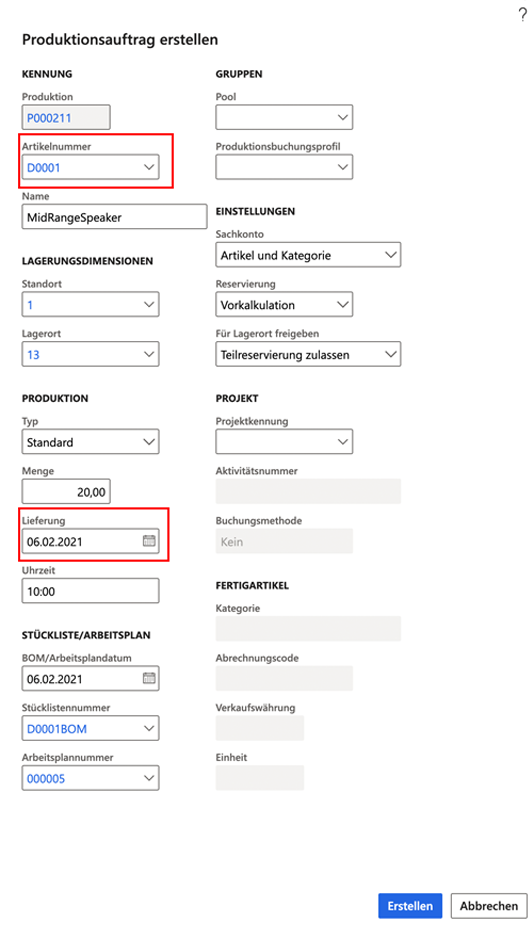

---
lab:
  title: "Lab\_4: Erstellen eines Produktionsauftrags"
  module: 'Module 3: Learn the Fundamentals of Microsoft Dynamics 365 Supply Chain Management'
---

## Lab 4: Erstellen eines Produktionsauftrags

## Ziele

The production order contains information about what will be produced, the quantity to produce, and the planned finish date. It also contains information about which materials to consume and which process to follow to produce the item.

Sie müssen einen neuen Produktionsauftrag für Ihr Unternehmen erstellen.

## Lab-Einrichtung

   - **Geschätzte Dauer**: 5 Minuten

## Anweisungen

1. Überprüfen Sie auf der Finance and Operations-Startseite oben rechts, ob Sie mit dem USMF-Unternehmen zusammenarbeiten.

1. Wählen Sie bei Bedarf das Unternehmen und im Menü **USMF** aus.

1. Wählen Sie im linken Navigationsbereich **Module** > **Produktionssteuerung** > **Produktionsaufträge** > **Alle Produktionsaufträge** aus.

1. Wählen Sie im oberen Menü **Neuer Fertigungsauftrag** aus.

1. Geben Sie unter **IDENTIFIZIERUNG** im Feld **Artikelnummer** **D0001** ein und wählen Sie dann das identifizierte Element aus.

1. Wählen Sie unter **PRODUKTION** im Feld **Lieferung** ein Datum einen Monat nach dem heutigen Datum aus.  
    The delivery date indicates when the production order should end in order to deliver on time. This date can be used in the scheduling process. For example, you can schedule the order backward from the delivery date.

1. Geben Sie im Feld **Menge** **20** ein.

1. Under <bpt id="p1">**</bpt>BOM/ROUTE<ept id="p1">**</ept>, the BOM number field automatically displays the number of any active BOM for the current item, but you can change the BOM for the production order by selecting an active BOM from the list of approved BOM versions. The Route number field automatically displays the number of any active Route for the current item, but you can change the Route for the production order by selecting an active Route from the list of approved Route versions.

    

1. Klicken Sie auf **Erstellen**.
